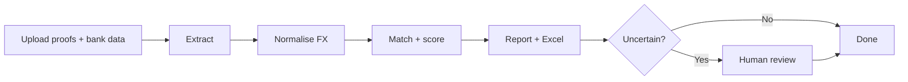

# ARIA

**Autonomous Reconciliation Intelligence Agent**

> **AI Marathon 2026 · Challenge Track 3 — Global Treasury Agent**

An SME invoices a US buyer for **USD 10.00**. SWIFT lands **MYR 42.30** in the local account — not the MYR 42.50 expected at invoice rate. Was it the right payment? Which invoice? Why the variance?

Finance teams answer that question **on every cross-border transaction**, from WhatsApp screenshots and SWIFT PDFs, in spreadsheets that take **2–4 hours per batch**. ARIA does it in **under 60 seconds** — with explainable AI reasoning, human escalation for edge cases, and audit-ready Excel output.

**[Live documentation →](https://adamchok.github.io/Aria/)** · **[API reference →](https://adamchok.github.io/Aria/api-reference.html)** · **[Architecture →](https://adamchok.github.io/Aria/architecture.html)**

---

## Why ARIA

| | |
| --- | --- |
| **Impact** | Cross-border payment friction costs SMEs **> USD 120B/year**. ARIA targets the reconciliation gap that ERP modules ignore and spreadsheets cannot scale — turning a manual half-day cycle into a sub-minute autonomous workflow with full audit trails. |
| **Innovation** | The **LLM reasoning chain is the reconciliation engine**, not a bolt-on to fixed rules. Vision-first extraction handles format chaos; FX-aware matching reasons about invoice vs settlement rates and SWIFT deductions per transaction. |
| **Technical depth** | Production-grade **multi-tenant platform**: OpenAI Agents SDK pipeline, Celery workers, PostgreSQL, MinIO, SSE progress streams, HMAC webhooks, and a reference external client (NovaPay) that exercises the same REST API a real ERP would use. |

---

## By the numbers

| Metric | Target |
| --- | --- |
| Batch latency (50 transactions) | **< 60 s** |
| Match precision (confidence ≥ 0.75) | **> 90%** |
| Extraction accuracy (test corpus) | **> 95%** field-level |
| Human review escalation | **5–20%** of items |
| Supported corridors | **USD · EUR · GBP · SGD → MYR** |
| Batch capacity | Up to **200** transactions |

---

## Demo flow (5 minutes)

Run the full stack with Docker, then walk through the judge path in **NovaPay** — a reference SME client that calls the same API an external integrator would:

```bash
git clone https://github.com/adamchok/Aria.git && cd Aria
cp .env.example .env
# Set DEFAULT_ADMIN_PASSWORD in .env
docker compose up --build
# After Admin → tenant → API key: add VITE_API_KEY=aria_… to .env, then:
docker compose up --build frontend-novapay
```

| Step | Where | What to show |
| --- | --- | --- |
| 0 | Admin :5174 → Tenant mgmt :5175 | Bootstrap tenant + copy API key into `VITE_API_KEY` in `.env`; rebuild NovaPay (above) |
| 1 | [NovaPay :5173](http://localhost:5173) | Sign in (`finance@novapay.demo` / `novapay2026` — demo UI only; API uses `X-API-Key`) |
| 2 | `/upload` | Drop messy payment proofs + bank statement (or select a registered bank account ledger) |
| 3 | `/jobs/{id}` | Live four-stage stepper — Ingestion (proofs + bank statement) → Normalisation → Matching → Report (SSE stream) |
| 4 | `/jobs/{id}/results` | Summary cards, reconciliation grid, **variance explanation** for FX matches |
| 5 | `/jobs/{id}/review` | Confirm an uncertain match (confidence 0.50–0.74) — side-by-side proof vs bank line |
| 6 | Export | Download Excel — Summary, Matched, Exceptions, **Audit Log** |

**Mock LLM mode** runs without Anthropic API keys — ideal for local judging. For live Claude extraction, set `ANTHROPIC_API_KEY` and `LLM_MODE=live` in `.env`.

**API integration path:** NovaPay → `/ingest` pushes proofs via `POST /api/v1/ingest/transactions`; Tenant mgmt → `/webhooks` receives HMAC-signed `job.completed` / `job.review_required` events. See [Solution](docs/solution.md) for both flows.

---

## How it works



**Upload** — Multimodal ingestion from JPEG, PNG, WEBP, PDF, XLSX, CSV. Vision LLMs for images; structured parsers with LLM fallback for documents. No template OCR.

**Normalise** — Live and historical FX at invoice and settlement dates. Per-transaction tolerance windows account for SWIFT charges and a configurable variance buffer.

**Match** — Three-stage pipeline: deterministic date/amount filters → composite scoring (amount 40%, reference 30%, date 20%, payer 10%) → LLM reasoning with natural-language variance explanations.

**Review** — Never auto-confirms below 0.75 confidence. Uncertain items (0.50–0.74) route to a first-class human review queue with confirm, reject, and manual match actions.

Every agent decision is logged: input snapshot, reasoning chain, confidence, output, timestamp, `job_id`.

---

## What makes ARIA different

- **AI-first, not rule-first** — Rules are safety nets; the LLM handles ambiguity that fixed tolerances miss.
- **Platform, not a single app** — Multi-tenant API with JWT and API-key auth, continuous ingest, bank account ledger, webhooks, and SSE. NovaPay is a *reference client*, not the product.
- **Explainability as a feature** — *"ARIA matched because the settlement amount falls within the FX tolerance window for USD/MYR on the value date"* — not a black-box score.
- **Finance-grade output** — Decimal precision throughout; Excel export with four audit sheets; LangSmith traces for agent pipeline steps.

---

## Architecture

```text
NovaPay (X-API-Key) ─────────┐
Admin / Tenant mgmt (JWT) ───┼──► FastAPI ──► Celery ──► Agents SDK Pipeline
External SMEs (X-API-Key) ───┘         │                              │
                                  PostgreSQL                    Claude LLMs
                                  Redis · MinIO                 FX rate APIs
                               SSE + Webhooks ◄─────────────────────┘
```

| Layer | Stack |
| --- | --- |
| Backend | Python 3.11 · FastAPI · SQLAlchemy · Celery · OpenAI Agents SDK |
| Agents | Claude Sonnet (extract, match, report) · Haiku (normalisation) · vision-first ingestion |
| Frontend | React 18 · TypeScript · Tailwind · TanStack Query · AG Grid (3 role-scoped apps) |
| Infra | PostgreSQL · Redis · MinIO · Docker Compose |

---

## Quick start

**Prerequisites:** [Docker Desktop](https://www.docker.com/products/docker-desktop/)

```bash
git clone https://github.com/adamchok/Aria.git
cd Aria
cp .env.example .env
docker compose up --build
```

| Service | URL |
| --- | --- |
| NovaPay (reference client) | http://localhost:5173 |
| Admin UI (platform) | http://localhost:5174 |
| Tenant mgmt UI | http://localhost:5175 |
| API (Swagger) | http://localhost:8000/docs |

### First login

1. Set `DEFAULT_ADMIN_PASSWORD` in `.env` before starting the API.
2. **Admin UI** (:5174) — sign in with `DEFAULT_ADMIN_EMAIL` / your password.
3. Create a **tenant** and **tenant user**.
4. **Tenant mgmt** (:5175) — sign in with the tenant user you created in Admin.
5. **NovaPay** (:5173) — set `VITE_API_KEY` in repo-root `.env`, rebuild NovaPay, then sign in with demo UI credentials (`finance@novapay.demo` / `novapay2026`). API calls use the key, not JWT.

Programmatic access: create an API key in Tenant mgmt → `/keys`, then call endpoints with `X-API-Key`.

---

## Documentation

**[adamchok.github.io/Aria](https://adamchok.github.io/Aria/)** — searchable docs site with interactive pipeline widgets.

| Page | Description |
| --- | --- |
| [Problem Statement](docs/problem-statement.md) | The cross-border reconciliation gap |
| [Solution](docs/solution.md) | Value proposition, demo flows, differentiators |
| [Architecture](docs/architecture.md) | Agents, routing, data flow |
| [Getting Started](docs/getting-started.md) | Setup and hybrid local dev |
| [API Reference](docs/api-reference.md) | REST endpoints and job lifecycle |
| [Configuration](docs/configuration.md) | Environment variables |
| [Development](docs/development.md) | Tests and contribution guide |

Enable GitHub Pages: Repository Settings → Pages → Source: `/docs` on `master`.

---

## Repository structure

```text
Aria/
├── backend/                 FastAPI + OpenAI Agents SDK reconciliation pipeline
├── frontend-novapay/        NovaPay — reference SME client (port 5173)
├── frontend-admin/          Platform admin (port 5174)
├── frontend-tenant-mgmt/    Tenant configuration (port 5175)
├── docs/                    GitHub Pages documentation site
├── docker-compose.yml
└── ARIA_Technical_Specification.md
```

---

## Development

```bash
# Backend tests (no Docker required)
cd backend && pip install -e ".[dev]" && pytest -q

# Frontend tests (per app)
cd frontend-novapay && npm install && npm test
cd frontend-tenant-mgmt && npm install && npm test
cd frontend-admin && npm install && npm test
```

See [Development](docs/development.md) for hybrid setup, migrations, and conventions.

---

## Competition context

**Challenge Track 3 — The Global Treasury Agent**

SMEs receive cross-border payments as unstructured proofs — screenshots, PDFs, Excel exports — and must reconcile them against local bank statements despite FX timing differences, SWIFT deductions, and format fragmentation. Existing ERP modules, template OCR, and rule-based fintech tools were not built for this ambiguity.

ARIA is an **autonomous reconciliation platform**: external systems ingest continuously via API; the agent pipeline reconciles autonomously; results stream back in real time. Built to be integrated — not just demonstrated.

---

## License

See repository license file. Developed for **AI Marathon 2026**.
