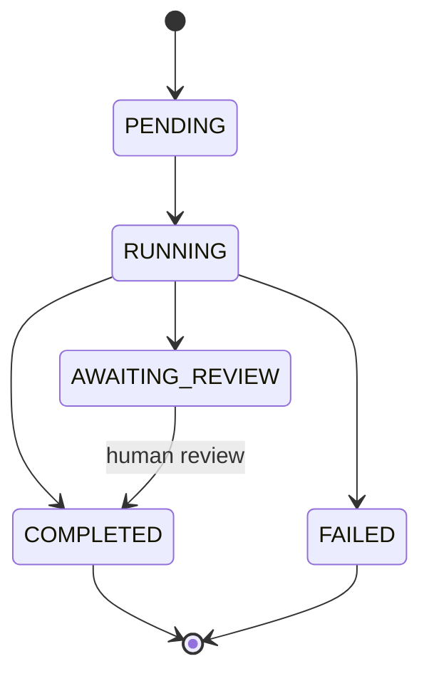

# API Reference

{: .no_toc }

## Table of contents
{: .no_toc .text-delta }
1. TOC
{:toc}

---

## Base URL

| Environment | Base URL |
| --- | --- |
| Local API | `http://localhost:8000` |
| Docker (direct) | `http://localhost:8000` |
| Docker (via frontend nginx) | `http://localhost:5173/api` |
| Vite dev proxy | `http://localhost:5173/api` |

Interactive documentation: [http://localhost:8000/docs](http://localhost:8000/docs) (Swagger UI)

All v1 routes are prefixed with `/api/v1`.

---

<div class="aria-endpoint">
  <div class="aria-endpoint__header">
    <span class="aria-method aria-method--get">GET</span>
    <span class="aria-endpoint__path">/health</span>
  </div>

### Health check

Returns service status and version.

**Response `200`**

```json
{
  "status": "ok",
  "version": "0.1.0",
  "env": "development"
}
```
</div>

---

<div class="aria-endpoint">
  <div class="aria-endpoint__header">
    <span class="aria-method aria-method--post">POST</span>
    <span class="aria-endpoint__path">/api/v1/jobs</span>
  </div>

### Submit reconciliation job

**Content-Type:** `multipart/form-data`

| Field | Type | Required | Description |
| --- | --- | --- | --- |
| `payment_proofs` | file[] | Yes | One or more payment proof files |
| `bank_statement` | file | Yes | Bank statement (XLSX, CSV, or PDF) |
| `base_currency` | string | No | ISO 4217 code (default: `MYR`) |

**Accepted MIME types for proofs:** `image/jpeg`, `image/png`, `image/webp`, `application/pdf`, `application/vnd.openxmlformats-officedocument.spreadsheetml.sheet`, `text/csv`, `application/csv`

**Response `201`**

```json
{
  "job_id": "550e8400-e29b-41d4-a716-446655440000",
  "status": "PENDING",
  "created_at": "2026-05-23T10:00:00Z"
}
```

**Errors**

| Status | Cause |
| --- | --- |
| `400` | Missing proofs or bank statement |
| `502` | Storage upload failure |

**Example**

```bash
curl -X POST http://localhost:8000/api/v1/jobs \
  -F "payment_proofs=@invoice.pdf" \
  -F "payment_proofs=@receipt.png" \
  -F "bank_statement=@statement.csv" \
  -F "base_currency=MYR"
```
</div>

---

<div class="aria-endpoint">
  <div class="aria-endpoint__header">
    <span class="aria-method aria-method--get">GET</span>
    <span class="aria-endpoint__path">/api/v1/jobs/{job_id}</span>
  </div>

### Poll job status

**Response `200`**

```json
{
  "job_id": "550e8400-e29b-41d4-a716-446655440000",
  "status": "RUNNING",
  "progress_pct": 50.0,
  "agents_completed": ["ingestion", "normalisation"],
  "error": null,
  "created_at": "2026-05-23T10:00:00Z",
  "updated_at": "2026-05-23T10:00:15Z"
}
```

**Job statuses**

| Status | Meaning | Badge |
| --- | --- | --- |
| `PENDING` | Queued, not yet started | <span class="aria-badge aria-badge--neutral">Pending</span> |
| `RUNNING` | Pipeline in progress | <span class="aria-badge aria-badge--progress">Running</span> |
| `COMPLETED` | Finished successfully | <span class="aria-badge aria-badge--matched">Complete</span> |
| `AWAITING_REVIEW` | Uncertain items need review | <span class="aria-badge aria-badge--uncertain">Review</span> |
| `FAILED` | Unrecoverable error | <span class="aria-badge aria-badge--unmatched">Failed</span> |

**Errors:** `404` if job not found.

The frontend polls this endpoint every **2 seconds** until a terminal status is reached.
</div>

---

<div class="aria-endpoint">
  <div class="aria-endpoint__header">
    <span class="aria-method aria-method--get">GET</span>
    <span class="aria-endpoint__path">/api/v1/jobs/{job_id}/results</span>
  </div>

### Retrieve reconciliation report

**Response `200`** — `ReconciliationReport`

```json
{
  "job_id": "550e8400-e29b-41d4-a716-446655440000",
  "summary": {
    "total": 4,
    "matched": 2,
    "uncertain": 1,
    "unmatched": 1,
    "total_value_myr": "1234.56"
  },
  "matches": [ "..." ],
  "audit_log": [ "..." ]
}
```

Each match in `matches` includes:

| Field | Type | Description |
| --- | --- | --- |
| `id` | UUID | Match identifier |
| `status` | enum | `MATCHED` \| `UNCERTAIN` \| `UNMATCHED` |
| `confidence` | float | 0.0 – 1.0 composite score |
| `amount_variance_myr` | string | Decimal as string |
| `variance_explanation` | string | Plain-language explanation |
| `reasoning_chain` | string | Full LLM chain for audit |
| `normalised_record` | object | Payment + MYR amounts + tolerance bounds |
| `bank_entry` | object \| null | Matched bank statement row |

**Live data after human review:** Match rows and summary counts are **merged from the database** on each request (not a frozen pipeline snapshot). After you `confirm` or `reject` via the review endpoint, call this again — or refresh the results page — to see updated statuses and counts. The executive narrative text is generated once at report time and is not regenerated after review.

**Errors:** `404` job not found · `409` job not yet complete
</div>

---

<div class="aria-endpoint">
  <div class="aria-endpoint__header">
    <span class="aria-method aria-method--get">GET</span>
    <span class="aria-endpoint__path">/api/v1/jobs/{job_id}/review</span>
  </div>

### Human review queue

**Response `200`** — `MatchResult[]`

```json
[
  {
    "id": "...",
    "status": "UNCERTAIN",
    "confidence": 0.68,
    "variance_explanation": "Amount differs by MYR 0.20, likely due to FX rate on settlement date...",
    "normalised_record": { "..." },
    "bank_entry": { "..." }
  }
]
```

Returns an empty array when no uncertain items remain.
</div>

---

<div class="aria-endpoint">
  <div class="aria-endpoint__header">
    <span class="aria-method aria-method--post">POST</span>
    <span class="aria-endpoint__path">/api/v1/jobs/{job_id}/review/{match_id}</span>
  </div>

### Submit human review decision

**Content-Type:** `application/json`

```json
{
  "action": "confirm",
  "bank_entry_id": null,
  "note": "Verified against SWIFT advice"
}
```

| Field | Type | Required | Description |
| --- | --- | --- | --- |
| `action` | enum | Yes | `confirm` \| `reject` \| `manual_match` |
| `bank_entry_id` | UUID | For `manual_match` only | Target bank entry (API integrators; the web UI uses `confirm` / `reject` only) |
| `note` | string | No | Optional reviewer note |

**Response `200`**

```json
{
  "match_id": "...",
  "status": "MATCHED",
  "human_reviewed": true
}
```

**Idempotency:** Re-submitting `confirm` or `reject` on an already-reviewed match returns the current state without error.

**Side effects:** Updates the match row, refreshes the stored report blob (matches + summary), and sets job status to `COMPLETED` when no uncertain items remain.

**Errors:** `404` match not found · `409` invalid job state
</div>

---

<div class="aria-endpoint">
  <div class="aria-endpoint__header">
    <span class="aria-method aria-method--get">GET</span>
    <span class="aria-endpoint__path">/api/v1/jobs/{job_id}/export</span>
  </div>

### Download Excel report

**Response `200`**

- **Content-Type:** `application/vnd.openxmlformats-officedocument.spreadsheetml.sheet`
- **Content-Disposition:** `attachment; filename="aria-reconciliation-{job_id}.xlsx"`

**Sheets:** Summary · Matched · Exceptions · Audit Log

Uses the same **live hydrated report** as `GET /results` (reflects human review decisions).

**Errors:** `404` job not found · `409` report not yet available

**Example**

```bash
curl -OJ http://localhost:8000/api/v1/jobs/YOUR_JOB_ID/export
```
</div>

---

## Job lifecycle



1. **Submit** — files uploaded to MinIO; job row created; Celery task enqueued
2. **Process** — worker runs LangGraph pipeline; progress updated per agent
3. **Complete** — report stored; status set to `COMPLETED` or `AWAITING_REVIEW`
4. **Review** (optional) — human confirms or rejects uncertain matches; results and export update immediately
5. **Export** — Excel generated from the hydrated report (includes review outcomes)

---

## Error responses

All errors return JSON:

```json
{
  "detail": "Human-readable error message"
}
```

| Status | Domain errors |
| --- | --- |
| `404` | Job or match not found |
| `409` | Invalid job state (e.g. results before complete) |
| `422` | Extraction failure |
| `502` | LLM or storage error |
| `503` | FX rate unavailable (all providers failed) |

---

## OpenAPI

The live OpenAPI 3 schema is served at:

- Swagger UI: [http://localhost:8000/docs](http://localhost:8000/docs)
- ReDoc: [http://localhost:8000/redoc](http://localhost:8000/redoc)
- JSON schema: [http://localhost:8000/openapi.json](http://localhost:8000/openapi.json)

Frontend TypeScript types in `frontend/src/types/api.ts` mirror these schemas. Monetary values are serialised as **strings** to preserve decimal precision across the JSON boundary.
