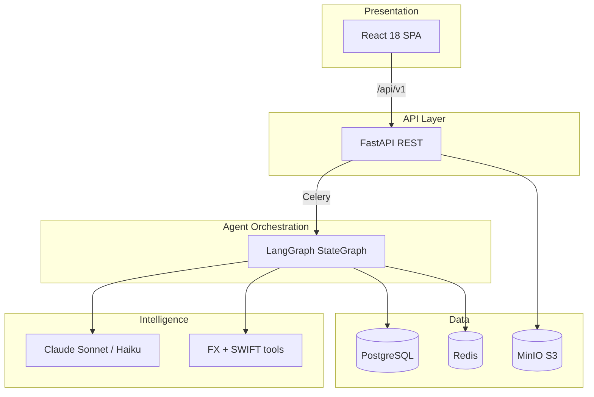
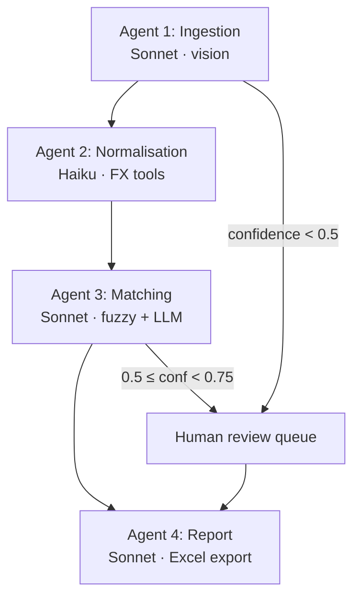

# Architecture

{: .no_toc }

## Table of contents
{: .no_toc .text-delta }
1. TOC
{:toc}

---

## System overview

ARIA is a stateful multi-agent system orchestrated by LangGraph, exposed through a FastAPI REST API and a React web application.



## Agent pipeline

Four specialised agents execute sequentially with shared typed state (`ReconciliationState`):



<div class="aria-pipeline">
  <span class="aria-pipeline__step aria-pipeline__step--active">Ingestion</span>
  <span class="aria-pipeline__step">Normalisation</span>
  <span class="aria-pipeline__step">Matching</span>
  <span class="aria-pipeline__step">Report</span>
</div>

### Agent responsibilities

| Agent | Model | Responsibility |
| --- | --- | --- |
| **Ingestion** | Sonnet (multimodal) | Extract `PaymentRecord` from images (vision), PDF/Excel/CSV (text); parse bank statements from XLSX, CSV, or PDF |
| **Normalisation** | Haiku | FX conversion to base currency; tolerance window calculation |
| **Matching** | Sonnet | FX-aware fuzzy match + confidence scoring + explanations |
| **Report** | Sonnet | Summary synthesis, exception narratives, Excel export |

### LangGraph routing

| From | To | Condition |
| --- | --- | --- |
| Ingestion | Normalisation | Records extracted; avg confidence ≥ 0.5 |
| Ingestion | Human review queue | No records or avg confidence &lt; 0.5 |
| Normalisation | Matching | Normalised records exist |
| Normalisation | Report | Nothing to match (empty report) |
| Matching | Report | Always |
| Report | END | Pipeline complete |

Implementation: `backend/app/graph/builder.py`, `backend/app/graph/routing.py`.

## Matching logic

### FX tolerance window

```python
# Inbound wire transfers: full SWIFT charge estimate applies.
# Payments under 1,000 units in source currency skip SWIFT deduction in the
# tolerance band (card / e-commerce debits). A 2.5% card FX markup is added
# to tolerance_high.
tolerance_low = (
    amount_myr_at_invoice_rate
    - charges_for_tolerance
    - FX_VARIANCE_BUFFER_PCT * amount_myr_at_invoice_rate
)

tolerance_high = (
    amount_myr_at_settlement_rate
    + FX_VARIANCE_BUFFER_PCT * amount_myr_at_settlement_rate
    + card_markup
)
```

Default `FX_VARIANCE_BUFFER_PCT = 0.015` (1.5%). Matching also scores payee names and foreign-currency amounts embedded in bank descriptions (e.g. `(USD 20.00)`).

### Composite confidence score

| Signal | Weight |
| --- | --- |
| Amount match | 0.40 |
| Date proximity | 0.20 |
| Reference similarity | 0.30 |
| Payer name | 0.10 |

### Three-stage matching

1. **Date filter** — ±5 days (configurable via `DATE_WINDOW_DAYS`)
2. **Amount filter** — within `[tolerance_low, tolerance_high]`
3. **LLM reasoning** — semantic match on reference, payer, residual variance

## Data flow

| Step | Actor | Input | Output | Est. latency |
| --- | --- | --- | --- | --- |
| 1. Upload | User / API | Proofs + bank statement | Job ID, S3 keys | &lt; 1 s |
| 2. Ingest | Agent 1 | Raw files | `List[PaymentRecord]` | 3–8 s / doc |
| 3. Normalise | Agent 2 | Records + FX API | `List[NormalisedRecord]` | 1–2 s / record |
| 4. Match | Agent 3 | Normalised + statement | `List[MatchResult]` | 2–5 s / match |
| 5. Report | Agent 4 | All match results | `ReconciliationReport` | 3–5 s |
| 6. Review | Human | UNCERTAIN items | Confirmed / rejected matches | Async; results re-hydrated from DB |

Jobs are processed asynchronously by a **Celery worker** backed by **Redis**. If Redis is unreachable, the API falls back to inline execution for developer convenience. On **Windows**, run the worker with `--pool=solo`.

## Core data models

```python
PaymentRecord       # Extracted payment: payer, amount, currency, date, confidence
NormalisedRecord    # MYR amounts at invoice/settlement rates + tolerance bounds
MatchResult         # Match status, confidence, variance, LLM explanation
ReconciliationReport # Summary stats + all match results + audit log
BankEntry           # Parsed row from bank statement
```

Schemas: `backend/app/models/schemas.py`.

## Technology stack

### Backend

| Component | Technology |
| --- | --- |
| API | FastAPI (Python 3.11+, async) |
| Agents | LangGraph `StateGraph` |
| LLM | Anthropic Claude (Sonnet + Haiku) |
| Task queue | Celery + Redis |
| Database | PostgreSQL 16 (SQLAlchemy 2.x async) |
| Migrations | Alembic |
| Object storage | MinIO (S3-compatible, boto3) |
| File parsing | pdfplumber, openpyxl, Pillow |
| Logging | structlog (JSON) |
| Observability | LangSmith (optional) |

### Frontend

| Component | Technology |
| --- | --- |
| Framework | React 18 + TypeScript (strict) |
| Build | Vite |
| Styling | Tailwind CSS |
| Server state | TanStack Query (2 s polling on job status) |
| UI state | Zustand |
| Tables | AG Grid Community |
| Routing | React Router v6 |
| Production serve | nginx (Docker) with `/api` reverse proxy |

### Infrastructure (Docker Compose)

| Service | Image / build | Port |
| --- | --- | --- |
| `postgres` | postgres:16-alpine | 5432 |
| `redis` | redis:7-alpine | 6379 |
| `minio` | minio/minio | 9000, 9001 |
| `api` | `./backend` | 8000 |
| `worker` | `./backend` | — |
| `frontend` | `./frontend` | 5173 → nginx:80 |

## Security considerations

- Documents stored encrypted at rest (AES-256 via S3/MinIO)
- Presigned URLs expire in 15 minutes (`S3_PRESIGN_TTL_SECONDS=900`)
- No payment PII in debug logs (payer names masked where applicable)
- Every LLM reasoning chain persisted in audit log
- Items below confidence 0.75 never auto-confirmed
- API keys via environment variables only — never committed

## Repository map

```text
backend/
├── app/
│   ├── main.py              FastAPI entry
│   ├── api/v1/              REST routes
│   ├── agents/              LangGraph node implementations
│   ├── graph/               StateGraph, routing, state model
│   ├── models/              Pydantic + SQLAlchemy models
│   ├── services/            FX, storage, LLM client, Excel export
│   ├── tools/               File parsers, FX/SWIFT tools
│   ├── workers/             Celery app + tasks
│   └── core/                Config, logging, database
├── alembic/                 DB migrations
└── tests/                   Unit, integration, agent tests

frontend/
├── src/
│   ├── pages/               Upload, Progress, Results, Review
│   ├── components/          UI components
│   ├── api/                 Typed fetch client
│   ├── hooks/               useJobStatus, useReviewActions
│   └── types/               Mirrors backend schemas
└── tests/                   Vitest + Playwright e2e
```

See [API Reference]({{ '/api-reference' | relative_url }}) for endpoints and [Getting Started]({{ '/getting-started' | relative_url }}) to run the stack.
