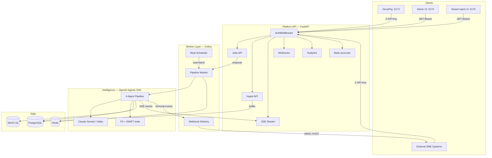
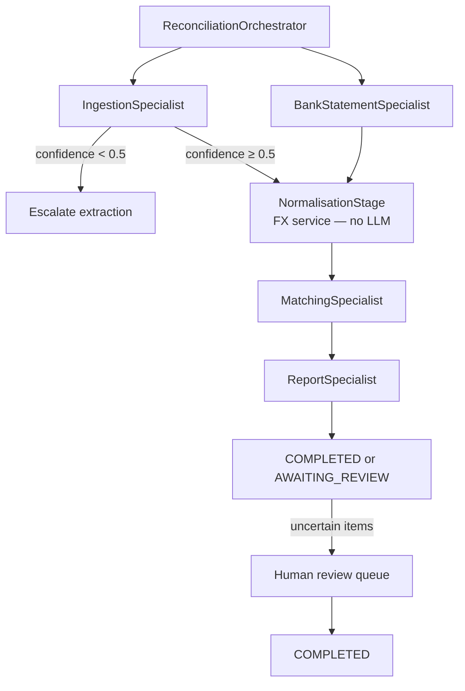

# Architecture

{: .no_toc }

## Table of contents
{: .no_toc .text-delta }
1. TOC
{:toc}

---

## System overview

ARIA is an **AI-first reconciliation platform**. The OpenAI Agents SDK orchestrator runs a deterministic multi-stage pipeline with Anthropic Claude specialists; **Admin** and **Tenant mgmt** connect with JWT Bearer tokens, while **NovaPay** and external integrators use tenant **API keys** (`X-API-Key`). Transactions flow in continuously from external systems, are automatically batched and queued, and the AI engine reconciles them without manual intervention.



## Agent pipeline

A **ReconciliationOrchestrator** manager agent coordinates specialist stages with shared typed state (`ReconciliationState`). Orchestration is deterministic Python (confidence routing enforced in code); specialists call Anthropic via `LLMService` with RTCIOC-structured prompts.



{::nomarkdown}

{:/nomarkdown}

### Agent responsibilities

| Agent | Model | Responsibility |
| --- | --- | --- |
| **Ingestion** | Opus (images), Haiku (Excel/CSV), Sonnet (PDF) | Extract `PaymentRecord` from images (vision), PDF/Excel/CSV (text) |
| **Bank statement ingestion** | Sonnet (PDF), Haiku (text/CSV) | Extract ledger `BankEntry` rows from statement PDFs (LLM-first; pdfplumber fallback); XLSX/CSV via structured parsers |
| **Normalisation** | FX service (no LLM) | FX conversion to base currency; tolerance window calculation; all records processed concurrently — FX cache pre-warmed for every (currency, date) pair, then `asyncio.gather` over all records |
| **Matching** | Sonnet | FX-aware fuzzy match + confidence scoring + explanations; Phase 1 pre-scoring runs in parallel via `run_in_executor` |
| **Report** | Sonnet | Summary synthesis, exception narratives, Excel export |

### Pipeline routing (deterministic)

| From | To | Condition |
| --- | --- | --- |
| Ingestion | Normalisation | Records extracted; avg confidence ≥ 0.5 |
| Ingestion | Human review queue | No records or avg confidence &lt; 0.5 |
| Normalisation | Matching | Normalised records exist |
| Normalisation | Report | Nothing to match (empty report) |
| Matching | Report | Always |
| Report | END | Pipeline complete |

Implementation: `backend/app/agents/sdk/runner.py`, `backend/app/agents/sdk/routing.py`, `backend/app/agents/sdk/orchestrator.py`.

### RTCIOC prompting

All specialist `Agent.instructions` follow a fixed six-section template (Role, Task, Input, Output, Constraints, Capabilities and reminders). Prompts live under `backend/app/agents/sdk/prompts/`. Critical rules are repeated at the bottom of each prompt (recency bias).

See [Development]({{ '/development' | relative_url }}) for contributor guidance.

## Matching logic

### FX tolerance window

```python
# Inbound wire transfers: full SWIFT charge estimate applies.
# Payments under 1,000 units in source currency skip SWIFT deduction in the
# tolerance band (card / e-commerce debits). A 2.5% card FX markup is added
# to tolerance_high.
tolerance_low = (
    amount_myr_at_invoice_rate
    - charges_for_tolerance
    - FX_VARIANCE_BUFFER_PCT * amount_myr_at_invoice_rate
)

tolerance_high = (
    amount_myr_at_settlement_rate
    + FX_VARIANCE_BUFFER_PCT * amount_myr_at_settlement_rate
    + card_markup
)
```

Default `FX_VARIANCE_BUFFER_PCT = 0.015` (1.5%). Matching also scores payee names and foreign-currency amounts embedded in bank descriptions (e.g. `(USD 20.00)`).

### Composite confidence score

| Signal | Weight |
| --- | --- |
| Amount match | 0.40 |
| Date proximity | 0.20 |
| Reference similarity | 0.30 |
| Payer name | 0.10 |

### Three-stage matching

1. **Date filter** — ±5 days (configurable via `DATE_WINDOW_DAYS`)
2. **Amount filter** — within `[tolerance_low, tolerance_high]`
3. **LLM reasoning** — semantic match on reference, payer, residual variance

**Performance:** Phase 1 pre-scoring (`rapidfuzz` similarity) runs via `asyncio.gather` + `loop.run_in_executor` so all records score in parallel (rapidfuzz releases the GIL). Matching uses Sonnet throughout for LLM reasoning on pending records.

## Data flow

| Step | Actor | Input | Output | Est. latency |
| --- | --- | --- | --- | --- |
| 1. Upload | User / API | Proofs + bank statement | Job ID, S3 keys | &lt; 1 s |
| 2. Ingest | Agent 1 | Raw files | `List[PaymentRecord]` | 3–8 s / doc |
| 3. Normalise | Agent 2 | Records + FX API | `List[NormalisedRecord]` | ~max(single FX call); all records run concurrently after cache pre-warm |
| 4. Match | Agent 3 | Normalised + statement | `List[MatchResult]` | 2–5 s / match |
| 5. Report | Agent 4 | All match results | `ReconciliationReport` | 3–5 s |
| 6. Review | Human | UNCERTAIN items | Confirmed / rejected matches | Async; results re-hydrated from DB |

Jobs are processed asynchronously by a **Celery worker** backed by **Redis**. If Celery **task dispatch** fails (broker unreachable), the API falls back to inline execution. On **Windows**, run the worker with `--pool=solo`.

## Webhook events

ARIA delivers signed HMAC-SHA256 `POST` payloads to registered tenant endpoints at pipeline milestones. All payloads include `job_id`, `event`, and `timestamp`.

| Event | When fired | Extra payload fields |
| --- | --- | --- |
| `job.created` | Job accepted by the API (before pipeline starts) | — |
| `job.stage_completed` | Each pipeline stage finishes (ingestion, normalisation, matching, report) | `stage` — the stage name |
| `job.completed` | Pipeline finished; all matches auto-resolved | `summary` (matched/uncertain/unmatched/total counts) |
| `job.review_required` | Pipeline finished with items needing human review (status `AWAITING_REVIEW`) | `summary` (same shape) |
| `job.failed` | Pipeline failed | `error` — reason string |

Register endpoints and inspect delivery history in the **Tenant Management** UI (`/webhooks`) or via the REST API (`POST /api/v1/webhooks`). Deliveries are retried up to `WEBHOOK_MAX_RETRIES` times with exponential backoff.

{: .important }
> Set `WEBHOOK_SECRET_ENCRYPTION_KEY` once on first deploy and **never rotate it**. Rotating this key will render all existing webhook secrets unreadable and break delivery until webhooks are recreated.

## Core data models

```python
# Reconciliation
PaymentRecord        # Extracted payment: payer, amount, currency, date, confidence
NormalisedRecord     # MYR amounts at invoice/settlement rates + tolerance bounds
MatchResult          # Match status, confidence, variance, LLM explanation
ReconciliationReport # Summary stats + all match results + audit log
BankEntry            # Parsed row from bank statement

# Platform (multi-tenancy & auth)
TenantORM            # Tenant: name, created_at
UserORM              # Email/password user: role (admin | tenant_user), tenant_id
ApiKeyORM            # API key: tenant_id, key_hash (SHA-256), label, last_used_at, enabled
TransactionBufferORM # Inbound transactions staged before batching
WebhookORM           # Registered endpoint: url, events, secret_hash, enabled
WebhookDeliveryORM   # Delivery log: status, attempt_count, response_code
BankAccountORM       # Named bank account per tenant (currency, bank name)
BankStatementORM     # Uploaded statement linked to account; entries with cleared flag
```

Pydantic schemas: `backend/app/models/schemas.py`. SQLAlchemy models: `backend/app/models/database.py`.

## Technology stack

### Backend

| Component | Technology |
| --- | --- |
| API | FastAPI (Python 3.11+, async) |
| Agents | OpenAI Agents SDK + Anthropic Claude (`LLMService`) |
| LLM | Anthropic Claude (Sonnet + Haiku) |
| Task queue | Celery + Redis |
| Database | PostgreSQL 16 (SQLAlchemy 2.x async) |
| Migrations | Alembic |
| Object storage | MinIO (S3-compatible, boto3) |
| File parsing | pdfplumber, openpyxl, Pillow |
| Logging | structlog (JSON) |
| Observability | LangSmith (optional) |

### Frontend

Three role-scoped React apps plus **NovaPay**, a reference external client, share UI patterns but deploy independently:

| App | Port | Role | Primary screens |
| --- | --- | --- | --- |
| `frontend-novapay` | 5173 | External SME client (demo) | Upload, jobs, results, review, ingest simulation |
| `frontend-admin` | 5174 | Platform admin | Tenants, users, cross-tenant analytics |
| `frontend-tenant-mgmt` | 5175 | Tenant admin | API keys, webhooks, bank accounts, tenant analytics |

**NovaPay** is not part of ARIA's internal operator tooling. It simulates how a tenant's finance system (ERP, treasury portal, payment ops tool) consumes the ARIA REST API — demo UI login plus `X-API-Key` (`VITE_API_KEY`) for all backend calls, plus SSE progress, ingest endpoints, and human review — so integrators can see a working reference without building from scratch.

| Component | Technology |
| --- | --- |
| Framework | React 18 + TypeScript (strict) |
| Build | Vite |
| Styling | Tailwind CSS |
| Auth | JWT Bearer in admin/tenant-mgmt (`auth-store`); NovaPay sends `X-API-Key` from `VITE_API_KEY` (demo `/login` is UI-only) |
| Server state | TanStack Query + SSE (`useJobStream` in NovaPay; `?api_key=` on EventSource) |
| UI state | Zustand (`auth-store`, `upload-store` in NovaPay only) |
| Tables | AG Grid Community |
| Routing | React Router v6 |
| Production serve | nginx (Docker) with `/api` reverse proxy |

### Infrastructure (Docker Compose)

| Service | Image / build | Port | Role |
| --- | --- | --- | --- |
| `postgres` | postgres:16-alpine | 5432 | Primary database |
| `redis` | redis:7-alpine | 6379 | Celery broker + result backend |
| `minio` | minio/minio | 9000, 9001 | Object storage |
| `api` | `./backend` | 8000 | FastAPI REST |
| `worker` | `./backend` | — | Celery pipeline worker |
| `beat` | `./backend` | — | Celery Beat scheduler (auto-batching) |
| `frontend-novapay` | `./frontend-novapay` | 5173 → nginx:80 | NovaPay reference client SPA |
| `frontend-admin` | `./frontend-admin` | 5174 → nginx:80 | Platform admin SPA |
| `frontend-tenant-mgmt` | `./frontend-tenant-mgmt` | 5175 → nginx:80 | Tenant configuration SPA |

## Security considerations

- **Authentication** — `AuthMiddleware` accepts **JWT Bearer** tokens (Admin and Tenant mgmt UIs) or **`X-API-Key`** (NovaPay reference client, external integrators, and programmatic access). API keys validated via SHA-256 hash; raw keys never stored. SSE streams accept `?access_token=` (JWT) or `?api_key=` because `EventSource` cannot send headers — NovaPay uses `?api_key=`.
- **Roles** — `admin` (platform), `tenant_user` (scoped to one tenant). Admin may impersonate a tenant via `X-Tenant-ID` header.
- **Multi-tenancy** — row-level isolation: all queries filter by `tenant_id`; MinIO object paths prefixed with `{tenant_id}/`
- **Webhook signing** — HMAC-SHA256 (Stripe model); 5-minute timestamp tolerance prevents replay
- **SSRF guard** — webhook URLs validated against a blocklist before registration (no private/loopback addresses)
- Documents optionally encrypted at rest when `S3_SERVER_SIDE_ENCRYPTION=AES256` is set (AWS S3). Default Docker MinIO stack stores objects without SSE — leave unset locally
- Presigned URLs expire in 15 minutes (`S3_PRESIGN_TTL_SECONDS=900`)
- No payment PII in debug logs (payer names masked where applicable)
- Every LLM reasoning chain persisted in audit log
- Items below confidence 0.75 never auto-confirmed
- Secrets via environment variables only — never committed

## Repository map

```text
backend/
├── app/
│   ├── main.py              FastAPI entry + middleware + admin seed
│   ├── api/v1/              REST routes
│   │   ├── auth.py          Login, /me
│   │   ├── users.py         Platform user CRUD (admin)
│   │   ├── tenant_settings.py  Tenant-scoped keys + users
│   │   ├── jobs.py          Job CRUD, list, cancel, dry_run
│   │   ├── review.py        Human review actions
│   │   ├── export.py        Excel export
│   │   ├── schedules.py     Reconciliation schedules
│   │   ├── stream.py        SSE endpoint
│   │   ├── tenants.py       Tenant + API key management (admin)
│   │   ├── ingest.py        Transaction ingestion + queue
│   │   ├── webhooks.py      Webhook CRUD + test + deliveries
│   │   ├── analytics.py     Tenant + admin analytics
│   │   ├── bank_accounts.py Bank accounts, statements, ledger
│   │   └── bank_statements.py Standalone statement upload/list
│   ├── agents/sdk/          OpenAI Agents SDK orchestrator, stages, prompts, LLMService
│   ├── graph/               ReconciliationState + pipeline alias (`builder.py`)
│   ├── models/              Pydantic + SQLAlchemy models
│   ├── repositories/        DB access layers
│   ├── services/            FX, storage, LLM client, Excel export
│   ├── tools/               File parsers, FX/SWIFT tools
│   ├── workers/             Celery app, pipeline task, Beat, webhook delivery
│   └── core/                Config, security, middleware, logging, database
├── alembic/                 DB migrations (0001–0013)
└── tests/                   Unit, integration, agent tests

frontend-novapay/            NovaPay: external SME API client demo
frontend-admin/              Admin: tenants, users, platform analytics
frontend-tenant-mgmt/        Mgmt: keys, webhooks, bank accounts, queue
```

See [API Reference]({{ '/api-reference' | relative_url }}) for endpoints and [Getting Started]({{ '/getting-started' | relative_url }}) to run the stack.
