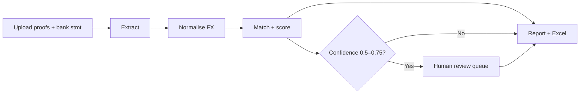

# Solution

{: .no_toc }

## Table of contents
{: .no_toc .text-delta }
1. TOC
{:toc}

---

## ARIA in one sentence

**ARIA** (Autonomous Reconciliation Intelligence Agent) is an AI-first reconciliation **platform**: external SME systems push transactions continuously through an authenticated API; the LangGraph pipeline reconciles them autonomously; results stream back in real time via SSE and webhooks. The reference UI doubles as an enterprise operations dashboard for finance teams who prefer a browser interface.

## Core value proposition

> ARIA converts a 2–4 hour manual reconciliation cycle into a **sub-60-second autonomous workflow**, with full auditability and human escalation for edge cases.

## End-to-end workflow

  Upload
  Extract
  Normalise
  Match
  Report
  Review

### Enterprise UI screens

| Route | Screen | Purpose |
| --- | --- | --- |
| `/dashboard` | **Pipeline Dashboard** | Job throughput, match-rate summary, recent jobs at a glance |
| `/jobs` | **Job Monitor** | Paginated, filterable job list with match counts per job |
| `/jobs/{id}` | **Job Progress** | Four-agent stepper driven by SSE (no polling) |
| `/jobs/{id}/results` | **Results** | Summary cards, filterable reconciliation grid, variance explanations |
| `/jobs/{id}/review` | **Review Queue** | Confirm / reject uncertain items side-by-side |
| `/queue` | **Transaction Queue** | Buffer status by corridor, oldest-transaction age, manual flush |
| `/analytics` | **Analytics** | Match rate, escalation rate, processing time, corridor breakdown |
| `/settings/keys` | **API Keys** | Generate and revoke tenant API keys; set session key |
| `/settings/webhooks` | **Webhooks** | Register endpoints, test delivery, inspect delivery history |
| `/upload` | **Upload** | Manual file submission (remains fully supported) |

### What the finance officer does (manual upload flow)

| Step | Screen | Action |
| --- | --- | --- |
| 1 | `/upload` | Drag payment proofs + bank statement; select base currency (MYR) |
| 2 | `/jobs/{id}` | Watch four-agent stepper; SSE delivers live progress |
| 3 | `/jobs/{id}/results` | Summary cards, filterable grid, variance explanations |
| 4 | `/jobs/{id}/review` | Confirm or reject uncertain items (side-by-side proof vs bank line) |
| 5 | Export | Download Excel — Summary, Matched, Exceptions, Audit Log |

### What an external SME system does (API integration flow)

1. **Authenticate** — obtain an API key from `/settings/keys` or via the admin key endpoint
2. **Ingest** — `POST /api/v1/ingest/transactions` with base64-encoded proofs and corridor metadata
3. **Receive** — register a webhook (`POST /api/v1/webhooks`); receive `job.completed` event with HMAC-signed payload when reconciliation finishes
4. **Retrieve** — call `GET /api/v1/jobs/{id}/results` for the full report, or follow the SSE stream

## Key differentiators

  

    
AI-first engine

    
The LLM reasoning chain is the reconciliation engine — rules are safety nets only.

  

  

    
Platform, not a tool

    
Multi-tenant API with key auth, continuous ingestion, webhooks, and SSE. Any SME system can integrate without the reference UI.

  

  

    
Vision-first ingestion

    
Multimodal extraction for images (PNG/JPG). PDF payment proofs and bank statements use structured parsers with LLM fallback.

  

  

    
FX-aware matching

    
Per-transaction tolerance windows using invoice and settlement rates plus SWIFT estimates.

  

  

    
Audit-ready output

    
Every decision includes variance explanation and full reasoning chain in the audit log.

  

  

    
Real-time visibility

    
SSE stream delivers pipeline progress per agent boundary. Webhooks push terminal events to external systems with HMAC-signed payloads.

  

## Confidence routing

| Confidence | Status | Action |
| ---: | --- | --- |
| ≥ 0.75 | Matched | Auto-match allowed |
| 0.50 – 0.74 | Uncertain | Human review queue; never auto-confirmed |
| &lt; 0.50 | Unmatched | Exception report |
| Extraction &lt; 0.50 | Escalated | Route to review |

{: .tip }
> ARIA matched because the settlement amount falls within the FX tolerance window for USD/MYR on the value date — not because amounts were identical. See [Architecture]({{ '/architecture' | relative_url }}) for tolerance calculation.

## Supported scope (MVP)

| Dimension | Coverage |
| --- | --- |
| **Input formats** | JPEG, PNG, WEBP, PDF, XLSX, CSV |
| **Corridors** | USD/MYR, EUR/MYR, GBP/MYR, SGD/MYR |
| **Batch size** | Up to 200 transactions |
| **Base currency** | MYR (configurable) |
| **Export** | Excel (.xlsx) with four sheets |

## Success metrics

| Metric | Target |
| --- | --- |
| Extraction accuracy | &gt; 95% field-level on test corpus |
| Match precision (conf ≥ 0.75) | &gt; 90% |
| Pipeline latency (50 tx) | &lt; 60 s |
| Escalation rate | 5–20% to human review |

See [Architecture]({{ '/architecture' | relative_url }}) for technical design and [Getting Started]({{ '/getting-started' | relative_url }}) to run it locally.
